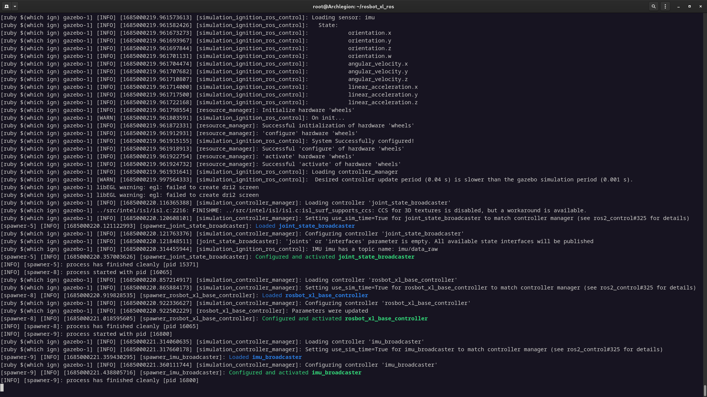
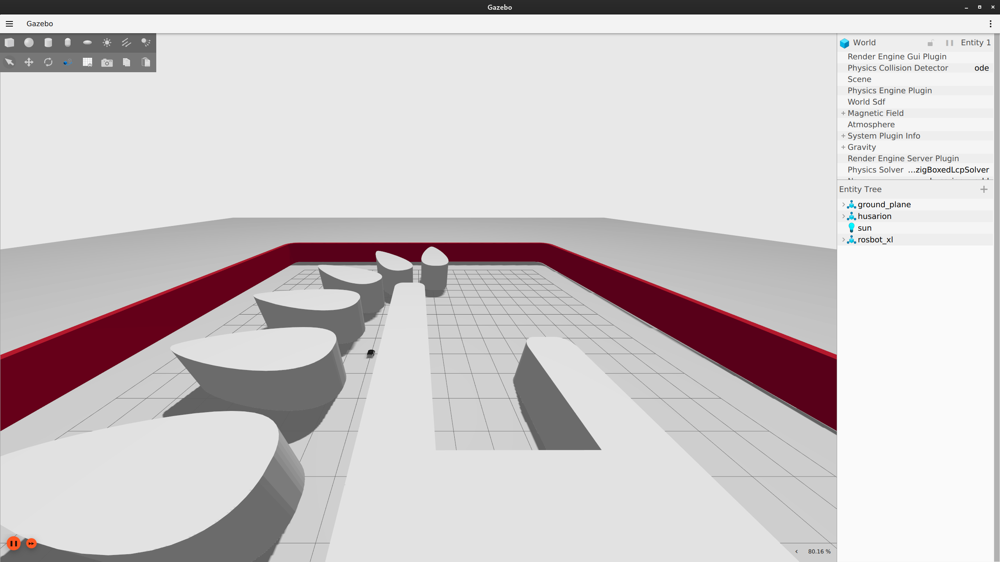
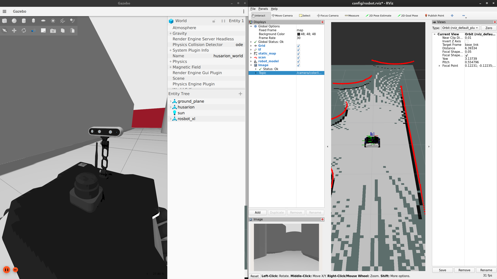

# rosbot_humble_wsl

## Prerequisities
- [Windows with WSL2 and XServer installed](https://jackkawell.wordpress.com/2020/06/12/ros-wsl2/) (do not follow this guide to install ROS because it is a wrong version)
- [ROS2 Humble (Desktop installation)](https://docs.ros.org/en/humble/Installation/Ubuntu-Install-Debians.html): you have to install it inside the Ubuntu in windows
- Visual-Studio-Code (there should be an extension for coding inside wsl)

## Create a ROS2 workspace and cloning Rosbot repository

Open WSL2 with Ubuntu 22.04. 
You can start cloning all the necessary packets to start the simulation.
First create a ROS2 workspace and git clone there the first package

```bash
mkdir -p ~/ros2_ws/src
cd ~/ros2_ws/src
git clone https://github.com/husarion/rosbot_xl_ros.git 
cd rosbot_xl_ros && git checkout 38a50d5
```

Install `colcon`, `vcs` and `rosdep`:

```bash
sudo apt-get update
sudo apt-get install -y python3-colcon-common-extensions python3-vcstool python3-rosdep
```

Now you can clone the other packages
```bash
export HUSARION_ROS_BUILD=hardware

source /opt/ros/$ROS_DISTRO/setup.bash

cd ~/ros2_ws

vcs import src < src/rosbot_xl_ros/rosbot_xl/rosbot_xl_simulation.repos
vcs import src < src/rosbot_xl_ros/rosbot_xl/rosbot_xl_hardware.repos

rosdep init
rosdep update --rosdistro $ROS_DISTRO
rosdep install -i --from-path src --rosdistro $ROS_DISTRO -y
colcon build --symlink-install
```

To run only the simulation:
```bash
cd ~/ros2_ws
source install/setup.bash
ros2 launch rosbot_xl_gazebo simulation.launch.py mecanum:=${MECANUM:-True}
```
 You should see something like this





## Learn the basics

You will work always inside a Linux Operative System; during first steps could be not easy, here some usefull links, but you can find other. 

* Learn some basics of Linux and CLI [here](https://www.google.com/url?sa=t&rct=j&q=&esrc=s&source=web&cd=&cad=rja&uact=8&ved=2ahUKEwie0cvp-I__AhXfYPEDHWmnBbkQFnoECAgQAQ&url=https%3A%2F%2Fwww.hostinger.com%2Ftutorials%2Flinux-commands&usg=AOvVaw3bFDUJzKp0g8pigSuQhZ4d)

* Follow the Official documentation of ROS2 Humble to learn how to work with ROS2. In particular follow the [Tutorials](https://docs.ros.org/en/humble/Tutorials.html).

* Clone this repository https://github.com/dottantgal/ROS2_learning.git and try to build with colcon. It contains a lot of example to develop ROS2 node in Python and C++.

**IMPORTANT**\
**If you have some doubts or question about ROS2 Humble follow this** [link](https://letmegooglethat.com/?q=ros2+humble+documentation).
(Googling is an important skill!)

<!-- if you have problems you have to set the ssh key associated with your github account. [This](https://docs.github.com/en/authentication/connecting-to-github-with-ssh/generating-a-new-ssh-key-and-adding-it-to-the-ssh-agent) is a possible way to set key. -->

## How to run the simulation with SLAM-toolbox and RViz2

Install some packages
```bash
sudo apt update
sudo apt install ros-humble-slam-toolbox
sudo apt install ros-humble-teleop-twist-keyboard
 
source /opt/ros/humble/setup.bash
```
Now copy on linux some configuration files inside this git repository; for example you can put them in a folder in `~`:

```bash
mkdir ~/config
```
copy in this folder the files `rosbot.rviz` `slam_toolbox_params_original.yaml`.

The command `source /opt/ros/humble/setup.bash` is important to help you using the key <kbd>Tab</kbd> to auto complete commands in terminal.

Install `terminator` and split windows

```bash
sudo apt update
sudo apt install terminator
```

Alternatively you can open 4 terminals. On each panel run:
- `ros2 launch rosbot_xl_gazebo simulation.launch.py mecanum:=${MECANUM:-True}`
- `ros2 run rviz2 rviz2 -d ~/config/rosbot.rviz`
- `ros2 launch slam_toolbox online_sync_launch.py slam_params_file:=~/config/slam_toolbox_params.yaml use_sim_time:=True`
- `bash -c "while true; do ros2 run nav2_map_server map_saver_cli --free 0.15 --fmt png -f ~/maps/map; sleep 5; done"`

You should see Rviz with laser scan and a building map. You can open another terminal and run `ros2 run teleop_twist_keyboard teleop_twist_keyboard` to control the robot

---

Some usefull commands during simulation:
- `rqt_graph`
- `ros2 run rqt_tf_tree rqt_tf_tree`
- `ros2 run plotjuggler plotjuggler`
- [Foxglove](https://docs.ros.org/en/humble/How-To-Guides/Visualizing-ROS-2-Data-With-Foxglove-Studio.html)

## How to add Camera sensor in simulation

If the previous simulation works, you can study how it works. Start by inspecting with Visual Studio Code the ROS2 workspace, in particular take a look in the launch file ``
You have first to change the rosbot model by adding 4 cameras, mounted on the chassis.
in `ros2_ws/src/rosbot_xl_ros/rosbot_xl_gazebo/launch/simulation.launch.py`. Edit the fields of the camera:

```python
34  camera_model = LaunchConfiguration("camera_model")
    declare_camera_model_arg = DeclareLaunchArgument(
        "camera_model",
        default_value="None",
        description="Camera model added to the URDF",
    )

    include_camera_mount = LaunchConfiguration("include_camera_mount")
    declare_include_camera_mount_arg = DeclareLaunchArgument(
        "include_camera_mount",
        default_value="False",
        description="Whether to include camera mount to the robot URDF",
    )
```

- replace `None` in `camera_model` with `intel_realsense_d435`
- replace `False` in `include_camera_mount` instead of `True`

Run again the simulation and you should see a new camera mounted on the rosbot and a new topic `/camera/color/image_raw`



You can edit the sensor model properties definitions following the launch files like a matrioska, to find where there is the sensor code (it is a bit tricky):

rosbot_xl_gazebo --> rosbot_xl_bringup --> rosbot_xl_controller --> rosbot_xl_description

Usefull files to study are `rosbot_xl.urdf.xacro` in `rosbot_xl_description/urdf` and `intel_realsense_d435.urdf.xacro` in `ros_components_description/urdf`. Try to edit this files to see in simulation what is changed and how to spawn the same model of camera in different positions and with different names

## Some Informationss about Aruco (size and models to insert in simulation)

## How to develop code

Feel free edit the packages in `ros2_ws/src` and to add your personal packages. I suggest you to use `ament_cmake` to create ros2 packages and not `ament_python` I advice you to develop using **Visual Studio Code**.

If you don't know how to develop using git and you want to learn you can follow [this guide](https://learngitbranching.js.org/) and the [official guide](https://git-scm.com/docs/git-commit) or also [this](https://www.atlassian.com/git/tutorials/saving-changes/git-commit). Or you can use [gitkraken](https://www.gitkraken.com/).


---

### Bug Report
- There are bugs regarding the RGBD and the orbbec_astra. If you have to work with RGB images work with `intel_realsense_d435.urdf.xacro`. You can try to solve by yourself debug, also inspecting this [link](https://github.com/gazebosim/docs/blob/master/citadel/sensors.md) and comparing with this [link](https://github.com/gazebosim/ros_gz/tree/ros2/ros_gz_sim_demos).

### Interesting things

- This is interesting [new repo about nav2](https://github.com/husarion/navigation2-docker)

---

## Credits
- https://github.com/husarion/rosbot-xl-docker
- https://github.com/husarion/rosbot-xl-mapping

## Extra
<!-- ### You can try to recover the dockerfile from the docker image

[Reference Link](https://github.com/husarion/rosbot-xl-docker/blob/main/Dockerfile.simulation)

To inspect the image:

```bash
docker run --rm \
    -v /var/run/docker.sock:/var/run/docker.sock \
    alpine/dfimage husarion/rosbot-xl-gazebo:humble-0.3.0-20230204 -->
```
